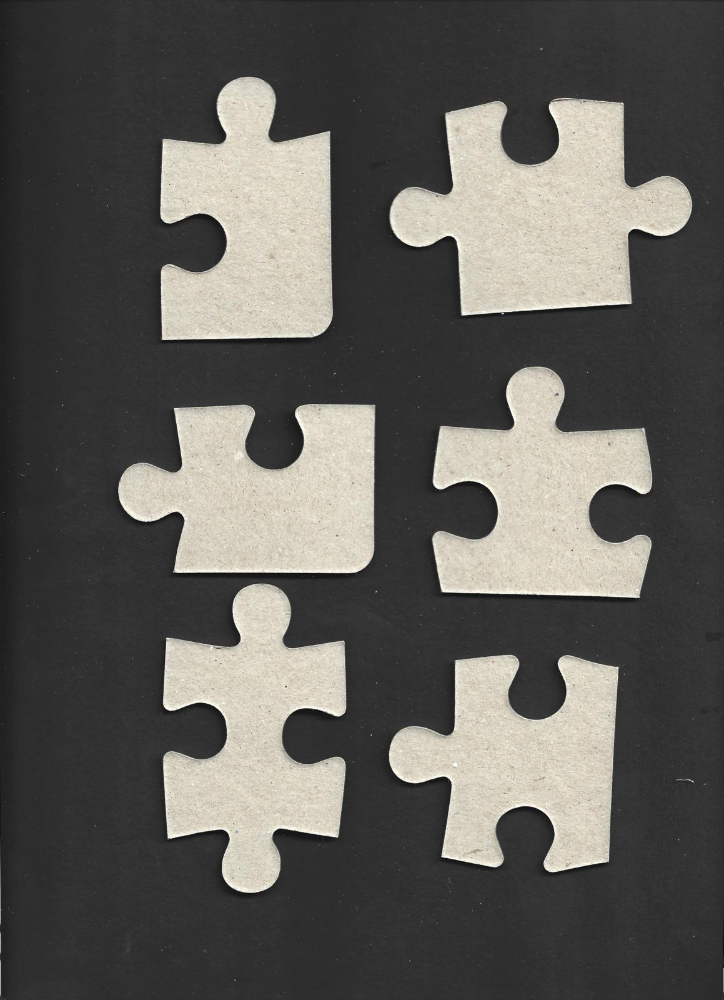

# 🧩 Jigsaw Puzzle Solver

This project implements a complete pipeline for solving jigsaw puzzles from image input to final assembly, using computer vision and algorithmic strategies. The final solution is visualized with an interactive GUI built using the Qt framework. The algorithm has been able to solve a puzzle up to 300 pieces.

## 📌 Features

- **Puzzle Piece Extraction**: Automatically identifies and segments individual pieces from the scanned input.
- **Piece Classification**: Analyzes the geometry of pieces to classify edges (flat, tab, blank).
- **Piece Matching**: Uses **Iterative Closest Point (ICP)** to match puzzle edges based on shape and appearance.
- **Solver Algorithm**: Constructs the final puzzle layout using a **random walk** over a **similarity matrix** derived from matching scores.
- **Interactive GUI**: Built with **Qt**, the graphical interface allows users to view the assembled puzzle.

## 🧠 Techniques Used

- **Computer Vision**: For image preprocessing, contour detection, and feature extraction.
- **ICP (Iterative Closest Point)**: To align and compare edge shapes for accurate matching.
- **Random Walk Solver**: Traverses high-confidence connections from the similarity matrix to iteratively build the complete puzzle.
- **Qt GUI**: Visualizes the solved puzzle.

## 📷 Data Requirements:

- **Scanning**: The backside of the puzzle pieces should be scanned, the algorithm is not capable yet to process the front side of the puzzle.
- **Background**: Use a **black cloth** or other dark, non-reflective background to ensure high contrast between the pieces and the surface.
- **Alignment**: Pieces should be **aligned as straight as possible**—not rotated or flipped—for best classification and matching results.
- **Spacing**: Leave **enough space** between pieces so that individual contours can be accurately extracted and identified.


## 🚀 Getting Started

### dependencies:
```bash
pip install -r requirements.txt
```
## Results:
**Input 12-piece puzzle:**
<p float="left">


</p>
**Solved 12-piece puzzle:**


**Solved 300-piece puzzle:**


